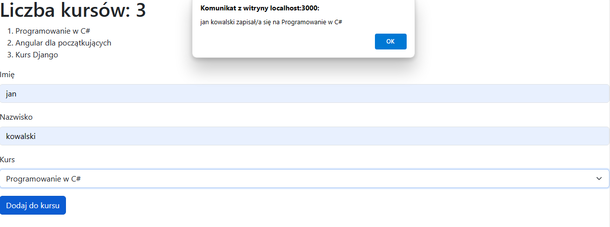
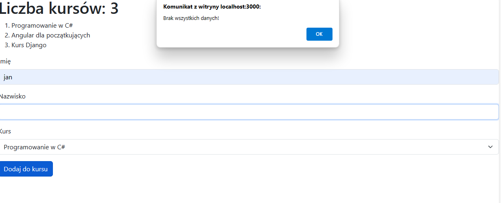

## Opis
Komponent CourseRegistration jest odpowiedzialny za wyświetlanie formularza do zapisu na kursy oraz obsługę tego formularza. Umożliwia użytkownikowi wprowadzenie swojego imienia, nazwiska oraz wyboru kursu z listy dostępnych.

## Metody
`handleChange(event)`: Obsługuje zmianę wartości pól formularza. Aktualizuje stan formData w zależności od wprowadzonych danych przez użytkownika.

`handleSubmit(event)`: Obsługuje zatwierdzenie formularza. Wyświetla alert z odpowiednią wiadomością w zależności od tego, czy wszystkie pola formularza zostały wypełnione.

## Zastosowane biblioteki i narzędzia
React: Wykorzystany do budowy interfejsu użytkownika.
Bootstrap: Wykorzystany do stylizacji formularza.
Wymagania
Aby korzystać z komponentu, należy mieć zainstalowaną bibliotekę React.
Dla prawidłowego działania komponentu, wymagana jest również biblioteka Bootstrap.

